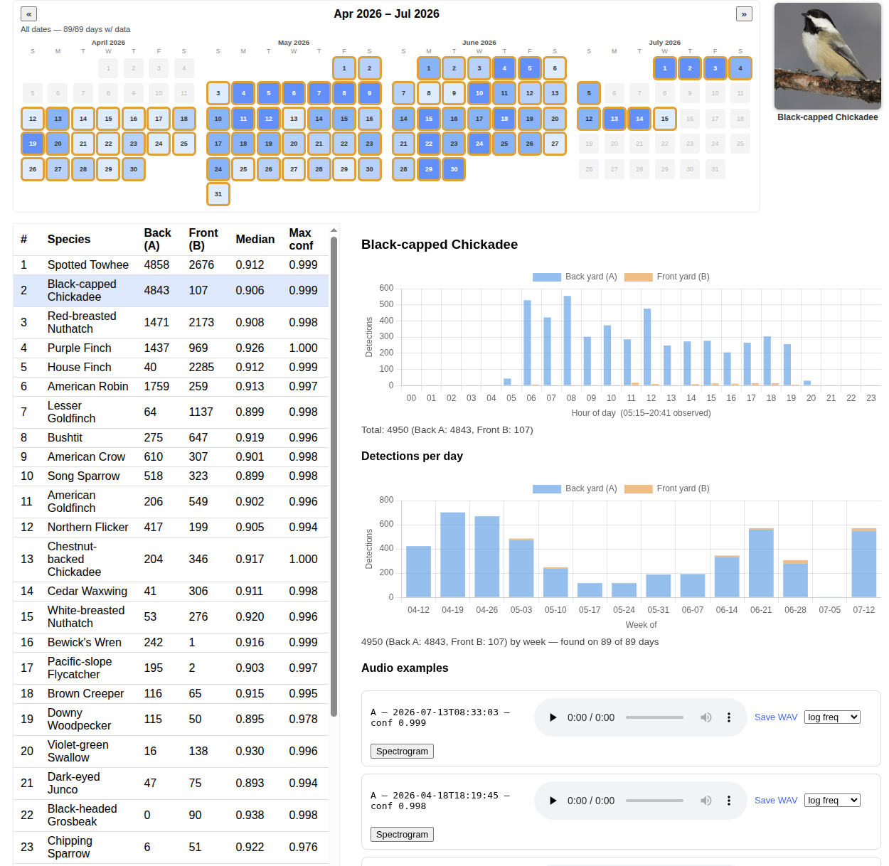

Use the BirdNET 2.4.0 analyzer to find calls of various bird species in FLAC audio recordings, and display the results on a web page. Example image of a given bird species is just scraped from the Wikipedia page for that bird (once, then cached locally) which probably violates some regulation of some kind.

